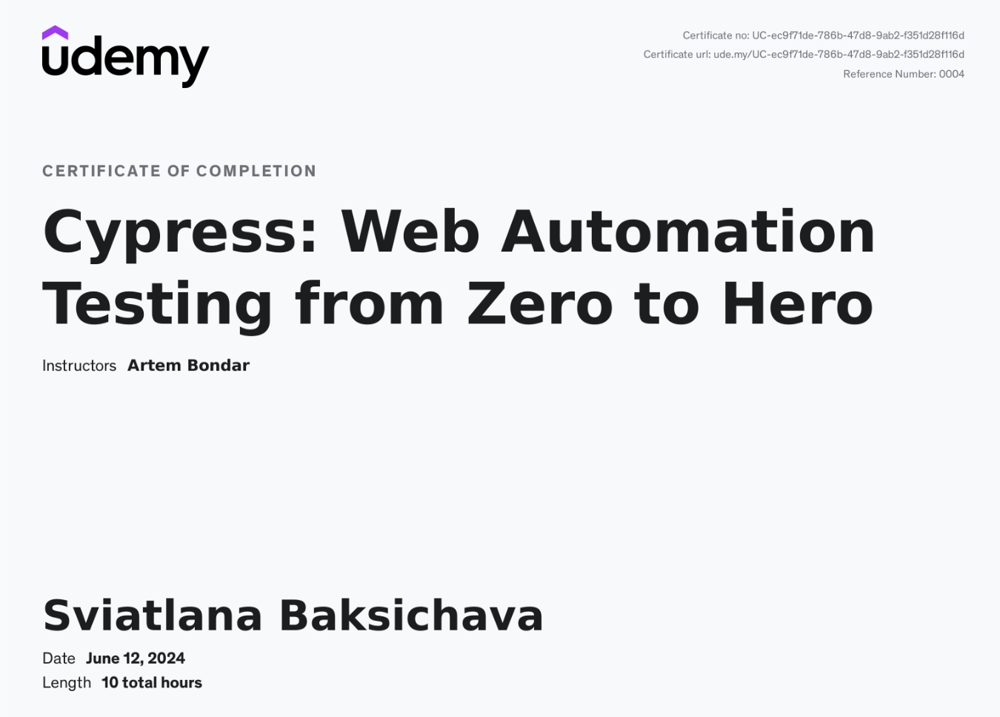

# Sviatlana Baksichava
## Manual QA with 4 Years of Experience | Junior Automation Engineer
### Professional Summary
I have 4 years of experience in manual functional testing, including 2.5 years in the fintech industry. Additionally, I am a junior automation engineer (JS + Cypress)

### Contact information
Discord: @sviatlana_baksichava
[Linkedin](https://www.linkedin.com/in/sviatlanabaksichava)
based in Vilnius, have EU Residence Permit (Lithuania)

### Skills
*Functional testing of new and existing features, with emphasis on back-end testing using Postman, Insomnia, and Swagger
*Integration testing with external bureaus, services, and API partners (credit history bureaus, identification and registration services, payment systems, statistics and analytics providers)
*Proficiency in SQL and databases, including MySQL (~1000 tables) and MongoDB
*A/B experimentation testing to evaluate feature effectiveness
*Security testing using BurbSuite for request and response analysis
*White-box testing, including DSL files for credit policy and validation of XML and JSON files
*Production (PROD) testing, bug localization from support tickets
*Test environment setup and maintenance in Jenkins, analyzing autotest reports with Allure
*Development and review of test documentation (test cases, checklists, bug reports), requirements testing
*Contribution to QA team knowledge sharing through articles on best practices
*Log analysis using Kibana, Grafana; alert monitoring in Zabbix; message analysis in Kafka and RabbitMQ (monitoring events queues)
*Task estimation and achieving established KPIs
*Test case maintenance for automation team (>15 test cases/month) using IntelliJ IDEA and Git (branch management, merging, conflict resolution, pull requests)
*Stakeholder feature demos
*Agile product lifecycle experience, including Scrum and Kanban methodologies

## Working Experience
### Nuvei, global payment technology partner for merchants and financial institutions, providing innovative payment solutions across all channels and platforms.
QA Engineer, Oct 2023 - current  
### ID FINANCE, online lender that provides loans to customers
QA Engineer, Nov 2021 – September 2023
### ALLOT, provider of network intelligence and security solutions
QA Engineer, Jul 2021 - Oct 2021
### SoftTeco, outsourcing software development company
Junior QA Engineer, Mar 2020 - Jul 2021

### Education
## Bachelor, Philology, Belarussian state university, 2017
## Courses
Cypress: Web Automation Testing from Zero to Hero

### Languages
English - B2

